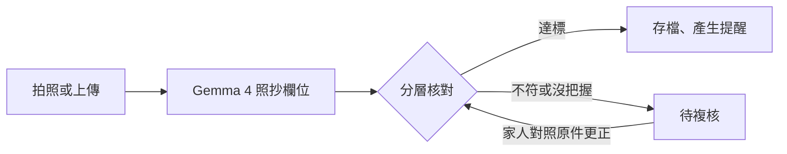

# 看有

[](LICENSE)


**結合視覺語言模型與分層核對機制之高齡家庭文書輔助系統**

拍一張照，看懂寄到家裡的帳單、公文、藥袋與發票。「看有」是台語 khuànn-ū，意思是「看得懂」。

> **English** — Khuànn-ū ("I can read it" in Taiwanese) helps older adults living alone or with an elderly partner,
> and family members who live elsewhere, understand the bills, official letters, medication bags and receipts that
> arrive at home. A local open model (Google Gemma 4) reads a photo of the document; deterministic checks such as
> e-invoice QR codes, checksums and date rules verify the reading; and the system decides by risk which items become
> reminders and which wait for a family member. It only helps people read: it never pays, replies or gives medical advice.

## 功能

- **拍照就能讀**：手機拍照或上傳圖片、PDF（加密的電子帳單也行）；結果頁最上面先回答要做什麼、什麼時候前、多少錢，還能唸出來。
- **讀值有依據**：電子發票逐欄比對左側 QR Code；其他文件檢查日期、金額與格式，畫面寫明每一項的證據強弱。
- **依風險行動**：核對達標的帳單與公文，期限自動列入首頁「要記得的事」，隨時可取消；藥袋整理成服藥時間表，等家人確認。
- **家人一起看**：從遠端確認或退回，任何讀值都能更正；更正後重新核對、重算提醒。
- **資料留在家裡**：預設全部在家裡的電腦上推論，不送雲端。

它只協助閱讀：不替人付款、不送出回覆、不給醫療建議。

## 運作方式



模型只把印刷文字照抄成欄位；核對、日期換算、期限推算與分級都由程式完成。「可信」一定要有模型以外的依據：
只有和 QR Code 比對過的項目會寫「相符」，只做規則檢查的文件會註明「不能證明讀對，請對照原件」。
完整的設計原則見[系統架構](docs/系統架構.md#14-設計原則)。

## 快速開始

需要 Python 3.12 以上。展示模式與測試不需要 GPU，也不需要模型。

### 展示模式

```bash
python -m venv .venv
.venv/bin/python -m pip install -r requirements.txt
.venv/bin/python tools/make_demo_docs.py              # 合成帳單、藥袋、公文
.venv/bin/python tools/make_sample.py --einvoice      # 合成電子發票（含一張金額不符）
.venv/bin/python tools/demo_server.py --reset --seed  # 瀏覽器開 http://localhost:8000
```

Windows 把 `.venv/bin/python` 換成 `.venv\Scripts\python`。展示模式的讀值是預錄的模擬資料，核對、決策與行動都是真實程式的結果。

測試：`.venv/bin/python -m pytest -q`（1,131 個，不連網、不呼叫真實模型）。

### 用真實模型

```bash
ollama pull gemma4:12b                                # 需要 Ollama 0.22 以上；約 8GB，放得進 16GB VRAM
.venv/bin/python -m uvicorn web.app:app --host 127.0.0.1 --port 8000
```

設定都在 [`config.yaml`](config.yaml)，每一項都有註解；辨識模式與自動存檔門檻也能在網頁的「設定」頁改。
讓家人用手機連上（Cloudflare Tunnel + Access）、雲端備援與開機自動啟動，見[部署指南](docs/部署指南.md)。

## 評測

`gemma4:12b`（RTX 5070 Ti 16GB）讀 11 張合成電子發票，平均 3.25 秒/張。其中 1 張刻意讓印刷金額和 QR Code 不符，模擬讀錯：

| 做法 | 自動存檔 | 存檔中的錯誤 | 轉人工 |
|---|---|---|---|
| 只看模型自評（11 張都是 0.95） | 11 | 1 | 0 |
| 分層核對 | 10 | 0 | 1 |

重現：`tools/make_sample.py --einvoice`（固定 seed），再執行 `tools/evaluate.py --model gemma4:12b`。

## 安全與隱私

- 開了雲端備援，藥袋、選了「醫療與保險」「身分證明」的文件和沒選類型的文件，仍只在本機推論。
- 送模型前去除 EXIF/GPS；網頁只綁 127.0.0.1，對外經 Cloudflare Tunnel + Access 登入。
- 文件上的文字只當資料：決定不了行動種類與分級，也產生不了付款或回覆。
- 藥袋只照抄印刷文字，服藥時間表一律等家人確認。

細節見[系統架構〈安全邊界〉](docs/系統架構.md#12-安全邊界)。

## 文件

- [使用手冊](docs/使用手冊.md)：長輩與家人的操作步驟
- [系統架構](docs/系統架構.md)：模組、資料流、分流規則、安全邊界、設計原則
- [部署指南](docs/部署指南.md)：家用 GPU 電腦上架、Cloudflare Tunnel + Access、開機自動啟動

## 授權

[Apache-2.0](LICENSE)。開發過程使用 Claude Code 輔助。
